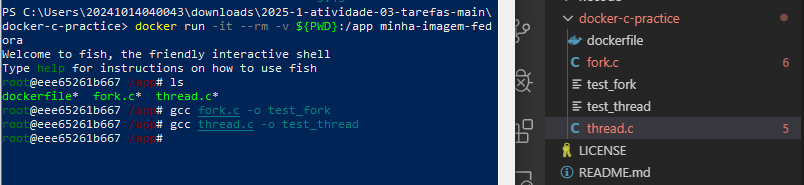

### S.O. 2025.1 - Atividade 03
# **Relatório de atividades práticas: Compilação de código dentro de Docker Fedora**
### Aluno: Josephy Cruz Araújo 
### Data: 16/05/2025

## Introdução: 
O objetivo desta atividade foi aprender a utilizar um Dockerfile para criar um ambiente isolado no Fedora capaz de compilar e executar programas em C. 

A prática incluiu:
- Construção de uma imagem Docker personalizada com ferramentas de desenvolvimento (GCC, Fish shell).
- Compilação e execução de programas que demonstram chamadas de sistema (fork.c) e threads (thread.c).
- Uso de volumes para compartilhar arquivos entre o host e o contêiner.

## Relato:
### 1. Criação do Dockerfile, construção da imagem Docker e execução do contêiner com volume: 
Iniciei o exercício fazendo um fork do repositório e criando uma pasta intitulada **"docker-c-practice"**, e dentro dela criando um arquivo dockerfile. Neste arquivo foi inserido o código contido na imagem abaixo: 

Vale salientar que nessa pasta também foram inclúidos os arquivos **"forc.c"** e **"thread.c"**, que virão a ser usandos posteriormente. Dentro deles foram inseridos os seguintes códigos, respectivamente: 

Em seguida executei o comando **"docker build -t minha-imagem-fedora ."** para criar um contêiner Docker com a imagem do Fedora utilizando Power Shell. A imagem foi baixada e o contêiner foi iniciado com sucesso.

Na imagem acima, ainda é possível verificar que iniciei o contêiner executando o mapeamento de volume, através do comando **"docker run -it --rm -v ${PWD}:/app minha-imagem-fedora"**. O terminal interativo do Fish shell foi iniciado. E, logo em seguida, para me certificar do compartilhamento dos arquivos locais, execeutei o comando **"ls"** para verificar se os arquivos dockerfile, fork.c, thread.c apareceram no diretório /app do contêiner.

### 2. Compilação e Execução dos Programas em C:
Após a verificação supracitada, procedi com a compilação dos arquivos **"fork.c"** e **"thread.c"**, como mostra a imagem a baixo: 

Executei os programas no terminal e obtive os seguintes retornos: 

A execução do programa **"fork.c"** tinha por objetivo demonstrar a criação de processos com fork() e execve(). Nele o processo pai cria um filho com fork() e o processo filho executa o comando /bin/date via execve().

O programa **"thread.c"** cria threads com pthread_create() e como saída cada thread imprime "Hello World!" e aguarda 5 segundos antes de encerrar.

## Conclusão: 
Aprendizados
- Dockerfile: Entendi como definir um ambiente reprodutível para desenvolvimento em C.
- Processos e Threads: Pratiquei chamadas de sistema (fork, execve) e threads POSIX.
- Volumes: Aprendi a compartilhar arquivos entre host e contêiner.

Dificuldades
- Criação do arquivo dockerfile, visto que precisava incluir o pacote e GCC e por erro de sitaxe, não consegui criar a imagem de pronto. 